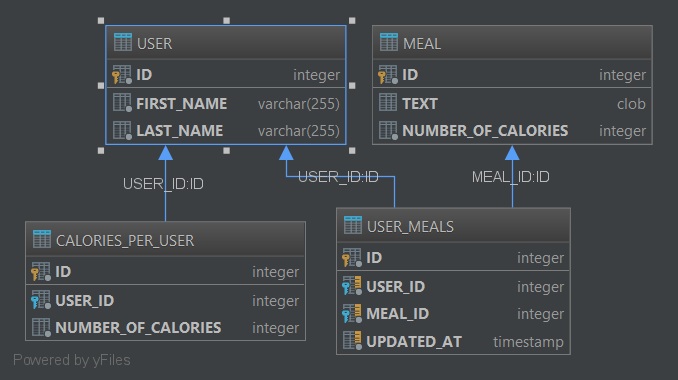

# kalories #
An application API to track your meals and calories.

# Requirements #

## Stories ##

1. As an Admin I want to set the expected number of calories per day in a settings' panel.
2. As a User I want to see a list of my meals and calories.
a. When displayed, the total for that day is colored in green if it’s below the expected
number, otherwise it is red.

3. As a User I want to input a meal with relative calories
4. As a User I want to be able to edit a meal
5. As a User I want to be able to delete a meal
6. As a User I want to be able to filter meals by date (from-to).
## Specs ##

A meal has the following fields:
- date
- time
- text
- number of calories

# Implementation #

## Architecture ##

Three layers:
- controller
- facade
- service

## Entity Relationship Diagram ##

## Implemented Stories ##

1. As an Admin I want to set the expected number of calories per day in a settings' panel.

Implementation:

    com.khlebtsov.kalories.layers.controller.impl.CaloriesControllerDefault.setCaloriesForUser

Test:

    com.khlebtsov.kalories.layers.controller.impl.CaloriesControllerDefaultTest.setCaloriesForUser

**2. As a User I want to see a list of my meals and calories.**

Implementation:

    com.khlebtsov.kalories.layers.controller.impl.MealControllerDefault.meals

Test:

    com.khlebtsov.kalories.layers.controller.impl.MealControllerDefaultTest.meals

*a. When displayed, the total for that day is colored in green if it’s below the expected number, otherwise it is red.*

Implementation:

    com.khlebtsov.kalories.layers.controller.impl.CaloriesControllerDefault.caloriesCount
      // which returns coories and coresponding status WARNING_EXCEED_THRESHOLD/OK that should be used to show res or green color in GUI

Test:

    com.khlebtsov.kalories.layers.controller.impl.CaloriesControllerDefaultTest.caloriesCount
  

**3. As a User I want to input a meal with relative calories**

Implementation:

    com.khlebtsov.kalories.layers.controller.impl.MealControllerDefault.updateMeal
   
Test:

    com.khlebtsov.kalories.layers.controller.impl.MealControllerDefaultTest.updateMeal

**4. As a User I want to be able to edit a meal**

Implementation:
    
    com.khlebtsov.kalories.layers.controller.impl.MealControllerDefault.addMeals

Test:

    com.khlebtsov.kalories.layers.controller.impl.MealControllerDefaultTest.updateMeal 

    
**5. As a User I want to be able to delete a meal**

Implementation:
    
    com.khlebtsov.kalories.layers.controller.impl.MealControllerDefault.deleteMeal

Test:

    com.khlebtsov.kalories.layers.controller.impl.MealControllerDefaultTest.deleteMeal

**6. As a User I want to be able to filter meals by date (from-to).**

Implementation:

    com.khlebtsov.kalories.layers.controller.impl.MealControllerDefault.meals
    
Test:

    com.khlebtsov.kalories.layers.controller.impl.MealControllerDefaultTest.mealsDateSet
    com.khlebtsov.kalories.layers.controller.impl.MealControllerDefaultTest.mealsRangeSet
    
    
 ## PS ##
 
 All services and Facades are covered by tests
 
 

 